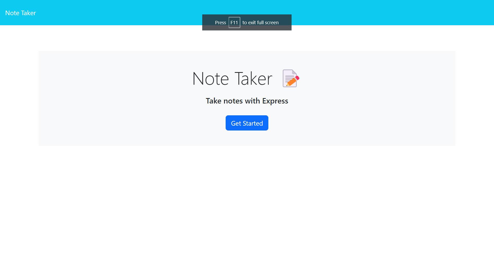
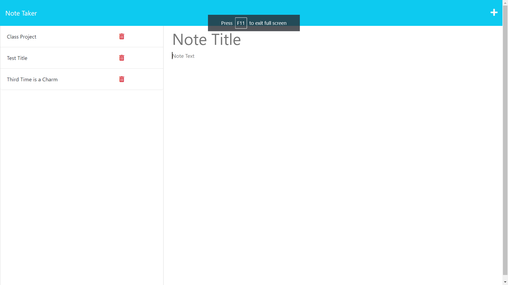
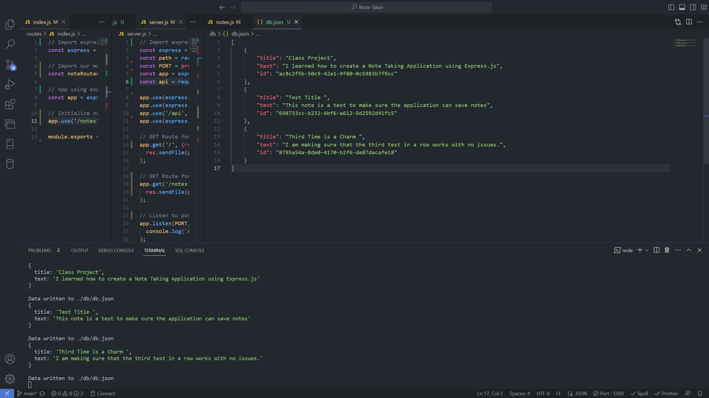

# Note Taker

## Description
The "Note Taker" application is an intuitive and user-friendly web tool designed for users who want to quickly save, and manage their notes. Built using the Express.js framework, this application offers seamless CRUD (Create, Read, Update, Delete) functionalities.

## Table of Contents
* [Technologies](#technologies)
* [Functionality](#functionality)
* [Usage](#usage)
* [Screenshots](#screenshots)
* [License](#license)

## Technologies
<ul>
<li>JavaScript</li>
<li>Node.js</li>
<li>Express.js</li>
<li>Heroku</li>
<ul>

## Functionality

Users can quickly take and save notes, all saved notes are organized and displayed on the left column, allowing users to review them easily. If you no longer desire a particular note, I was able to complete the "Bonus" and add a delete note feature. Notes are stored on the server in a JSON file. This ensures that they remain accessible even after the user exits or restarts the application.

## Screenshots
 
 
 

## License

&copy; 2023 Christian Flores

[MIT](https://github.com/git/git-scm.com/blob/main/MIT-LICENSE.txt)

## Contact
Email me any time with questions, comments, and/or concerns - Floresc712@yahoo.com
